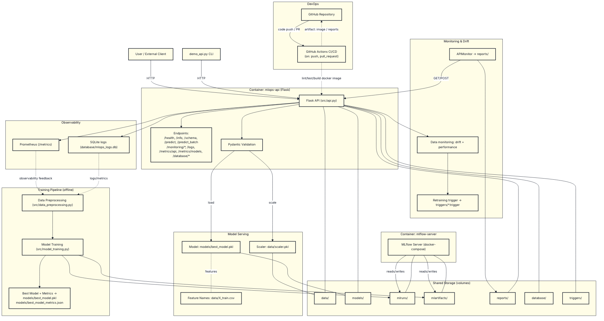

## High-level Architecture

This project serves a California Housing price prediction model via a Flask API, tracks experiments with MLflow, logs metrics to SQLite and Prometheus, and supports monitoring, drift detection, and retraining triggers. Docker Compose provides local orchestration; GitHub and GitHub Actions cover source control and CI/CD triggers on check-in.

Note: API framework is Flask (FastAPI not used).

### Diagram

### Components

- **API (Flask)**: `src/api.py` exposes `/predict`, `/predict_batch`, `/health`, `/info`, `/schema` plus monitoring and DB query endpoints. Uses Pydantic for validation, loads the best model and scaler, and emits Prometheus metrics.
- **ML Models**: Trained with `src/model_training.py`, best model stored at `models/best_model.pkl`; metrics stored at `models/best_model_metrics.json`. Individual models saved for comparison; MLflow tracks runs in `mlruns/` and artifacts in `mlartifacts/`.
- **Logging modules**: `src/database_logging.py` writes logs, API metrics, and model metrics to SQLite (`database/mlops_logs.db`). Console logging also enabled.
- **Database (SQLite)**: File-backed SQLite DB for logs/metrics: `database/mlops_logs.db`. Query via API endpoints: `/logs`, `/metrics/api`, `/metrics/models`, `/database/stats`, `/database/clear`.
- **MLflow**: Local MLflow server container (via `docker-compose.yml`) serving UI on port 5001; tracking directory `mlruns/` and artifacts `mlartifacts/` mounted as volumes.
- **Monitoring**: `src/monitoring.py` performs health checks and prediction probes, persists metrics to `reports/` and database, and generates `reports/api_monitoring_report.png` and `reports/monitoring_summary.json`.
- **Data Monitoring & Retraining**: `src/data_monitoring.py` detects drift (KS test) and performance degradation, and can write retraining triggers to `triggers/*.trigger`. Accessible via `/monitoring/*` endpoints in the API.
- **Docker**: `docker-compose.yml` defines `mlops-api` (exposes 5000) and `mlflow-server` (exposes 5001), mounting `models/`, `data/`, `mlruns/`, `mlartifacts/` as volumes.
- **GitHub**: Source control host for the repo.
- **GitHub Actions**: CI/CD flows triggered on `push` and `pull_request` to run lint/tests and optionally build images and publish artifacts. (A starter workflow can be added if desired.)
- **Clients**: `demo_api.py` CLI and any HTTP client; Postman collection available in `postman/`.

### Data Flow

1. Client sends JSON to `/predict` or `/predict_batch`.
2. API validates input (Pydantic), scales features with `data/scaler.pkl`, and predicts with `models/best_model.pkl`.
3. API logs request metrics to SQLite and emits Prometheus counters/histograms; returns prediction.
4. Monitoring jobs hit `/health` and `/predict`, saving time series and reports.
5. Data monitoring evaluates drift/performance and may create retraining trigger files.
6. Offline training pipeline preprocesses data, trains multiple models, tracks in MLflow, and writes the best model/metrics to `models/`.

### Notes

- API framework is Flask; FastAPI is not used in this project.
- Prometheus metrics are exposed at `/metrics` (scrape configuration is external to this repo).
- Docker Compose is intended for local development; deployment beyond local is not defined here.
